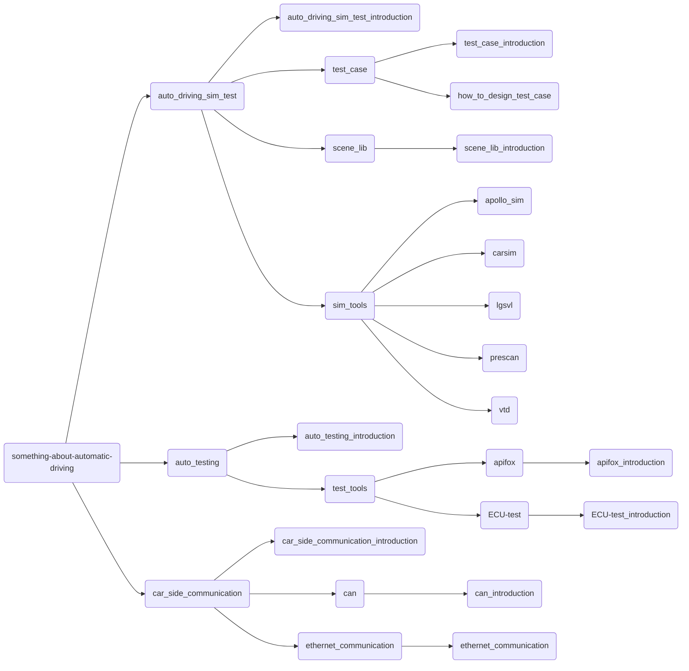

# 一、项目简介

本仓库用来记录本人学习自动驾驶技术的相关学习笔记。

# 二、项目内容

本项目记录了`自动驾驶仿真技术` `自动化测试` `车端通信`等相关知识点。每个文件夹中的`file_name_introduction`对该文件夹所涉及的知识点进行简要的介绍。

**目录架构：**

## 1. auto_driving_sim_test

这部分记录了自动驾驶仿真测试相关的学习笔记。[auto_driving_sim_test_intro](auto_driving_sim_test/auto_driving_sim_test_intro.md)介绍了仿真测试相关的基础知识。

## 2. auto_testing

这部分记录了关于自动化测试的一些学习笔记，其中[auto_testing_intro](auto_testing/auto_testing_intro.md)介绍了自动化测试相关知识。

## 3. vehicle_side_communication

这部分记录了车端通信的相关学习笔记，其中[vehicle_side_communication_intro](vehicle_side_communication/../verhicle_side_communication/verhicle_side_communication_intro.md)介绍了车端通信相关知识。

****
未完待续···