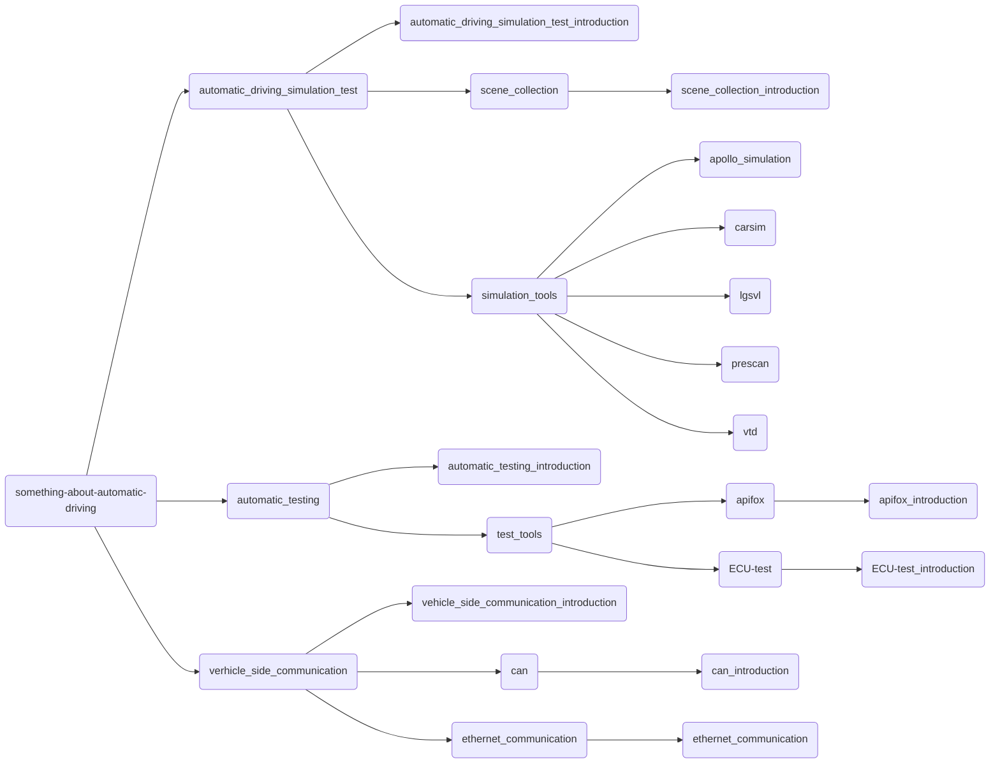

# 一、项目简介

本仓库用来记录本人学习自动驾驶技术的相关学习笔记。

# 二、项目内容

本项目记录了`自动驾驶仿真技术` `自动化测试` `车端通信`等相关知识点。每个文件夹中的`file_name_introduction`对该文件夹所涉及的知识点进行简要的介绍。

**目录架构：**

## 1. automatic_driving_simulation_test

这部分记录了自动驾驶仿真测试相关的学习笔记。[automatic_driving_simulation_test_introduction](automatic_driving_simulation_test/automatic_driving_simulation_test_introduction.md)介绍了仿真测试相关的基础知识

### 1.1 test_case

### 1.1.2 simulation_tools

## 2. automatic_testing

这部分记录了关于自动化测试的一些学习笔记，其中[automatic_testing_introduction](automatic_testing/automatic_testing_introduction.md)介绍了自动化测试相关知识。

## 3. vehicle_side_communication

这部分记录了车端通信的相关学习笔记，其中[vehicle_side_communication_introduction](vehicle_side_communication/vehicle_side_communication_introduction.md)介绍了车端通信相关知识。

****
未完待续···