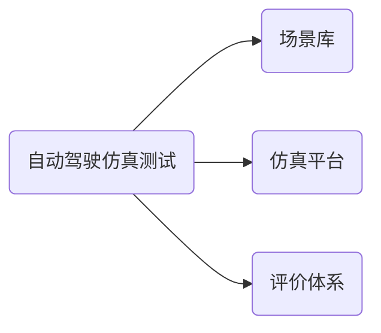

# 前言

## 自动驾驶虚拟仿真技术

虚拟仿真技术是汽车研发、制造、验证测试等环节重要的技术手段，能够有效的缩短技术和产品开发周期，降低研发成本；虚拟仿真测试是实现自动驾驶落地应用的关键一环，具备自动驾驶功能的车辆必须经过大量的虚拟仿真测试以及实车路测之后才能商业化。

**自动驾驶汽车商业化经历的三个测试阶段：** `仿真测试` `封闭场地测试` `开放道路测试`

# 自动驾驶仿真测试介绍

## 1. 什么是自动驾驶仿真测试?

### 1.1 仿真测试概念

自动驾驶仿真测试主要以数学建模的方式将自动驾驶的应用场景进行数字化还原，建立尽可能接近真实世界的系统模型，无需实车直接通过仿真测试便可达到对自动驾驶系统及其算法的测试验证目的。

### 1.2 仿真测试类型

自动驾驶仿真测试类型：模型在环仿真(MIL)——软件在环仿真(SIL)——硬件在环仿真(HIL)——整车在环仿真(VIL)

### 1.3 自动驾驶仿真测试组成部分



### 1.2 仿真测试优势

测试场景配置灵活:

测试过程安全:

可实现自动化测试和云端加速仿真测试:

****

## 2. 为什么要自动驾驶仿真测试?

根据美国兰德公司研究：一套自动驾驶系统至少需要通过110亿英里驾驶数据来进行系统和算法的测试验证工作才能达到量产的条件。
**实车路测存在的问题：**
  
- 道路测试周期长，成本高，效率低


<table>
  <tr>
    <td colspan="2">测试方法</td>
    <td>车辆</td>
    <td>传感器</td>
    <td>环境</td>
    <td>控制器</td>
    <td>驾驶员</td>
    <td>安全</td>
    <td>成本</td>
    <td>效率</td>
  </tr>
  <tr>
    <td rowspan="4">仿真测试</td>
    <td>MIL</td>
    <td>虚拟</td>
    <td>虚拟</td>
    <td>虚拟</td>
    <td>虚拟</td>
    <td>虚拟</td>
    <td>高</td>
    <td>低</td>
    <td>高</td>
  </tr>
  <tr>
    <td>SIL</td>
    <td>虚拟</td>
    <td>虚拟</td>
    <td>虚拟</td>
    <td>虚拟</td>
    <td>虚拟</td>
    <td>高</td>
    <td>低</td>
    <td>高</td>
  </tr>
  <tr>
    <td>HIL</td>
    <td>虚拟</td>
    <td>虚拟<br>部分真实</td>
    <td>虚拟</td>
    <td>真实</td>
    <td>虚拟</td>
    <td>高</td>
    <td>中</td>
    <td>中</td>
  </tr>
  <tr>
    <td>VIL</td>
    <td>真实</td>
    <td>真实</td>
    <td>虚拟<br>部分真实</td>
    <td>真实</td>
    <td>真实</td>
    <td>中</td>
    <td>中</td>
    <td>中</td>
  </tr>
  <tr>
    <td rowspan="2">实车测试</td>
    <td>封闭场地测试</td>
    <td>真实</td>
    <td>真实</td>
    <td>真实</td>
    <td>真实</td>
    <td>真实</td>
    <td>低</td>
    <td>高</td>
    <td>低</td>
  </tr>  
  <tr>
    <td>开放道路测试</td>
    <td>真实</td>
    <td>真实</td>
    <td>真实</td>
    <td>真实</td>
    <td>真实</td>
    <td>低</td>
    <td>高</td>
    <td>低</td>
  </tr>   
</table>


### 2.1 仿真测试目的

```
① 降低自动驾驶系统测试和回归测试的时间和成本，实现快速且经济的高覆盖测试
```
```
② 实现各种Corner Case的构造，尤其是危险场景的构造，提升测试覆盖
```
```
③ 避免实车路测的安全问题，包括人身财产以及合法合规问题
```

****

## 3. 如何进行自动驾驶仿真测试?

### 3.1 自动驾驶测试场景

自动驾驶汽车与其行驶环境各组成要素在一段时间内的总体动态描述，要素组成由所期望检验的自动驾驶汽车的功能决定。场景是自动驾驶汽车行驶场合和驾驶情景的有机组合，具有`无限丰富` `极其复杂` `难以预测` `不可穷尽`的特点。

### 自动驾驶仿真测试评价方法
