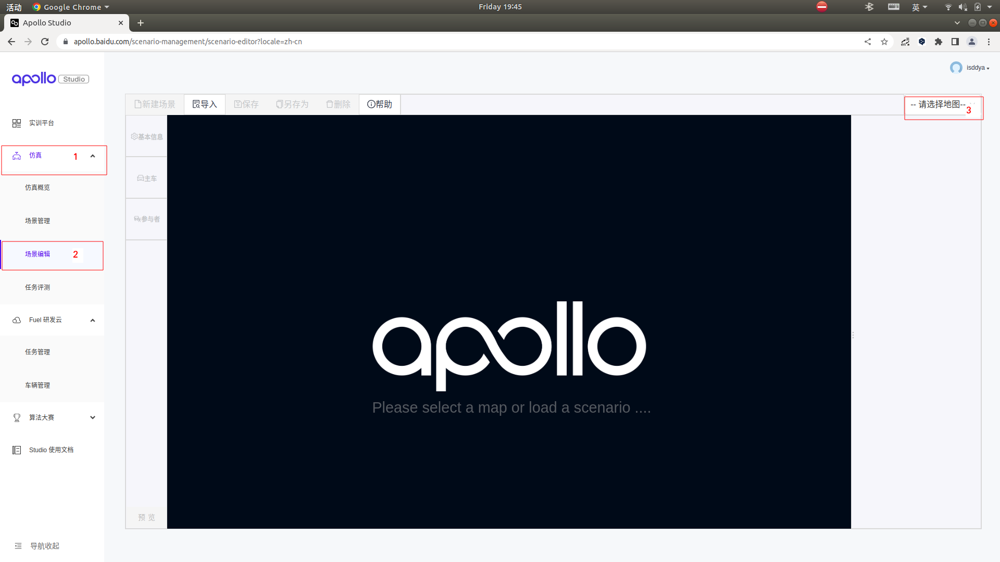
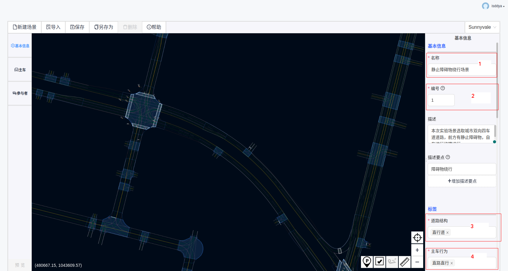
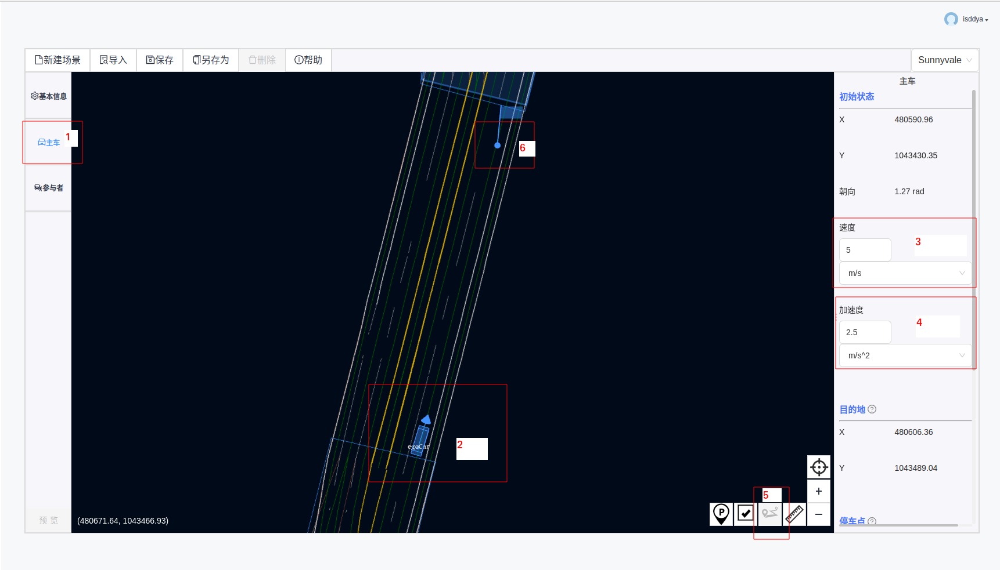
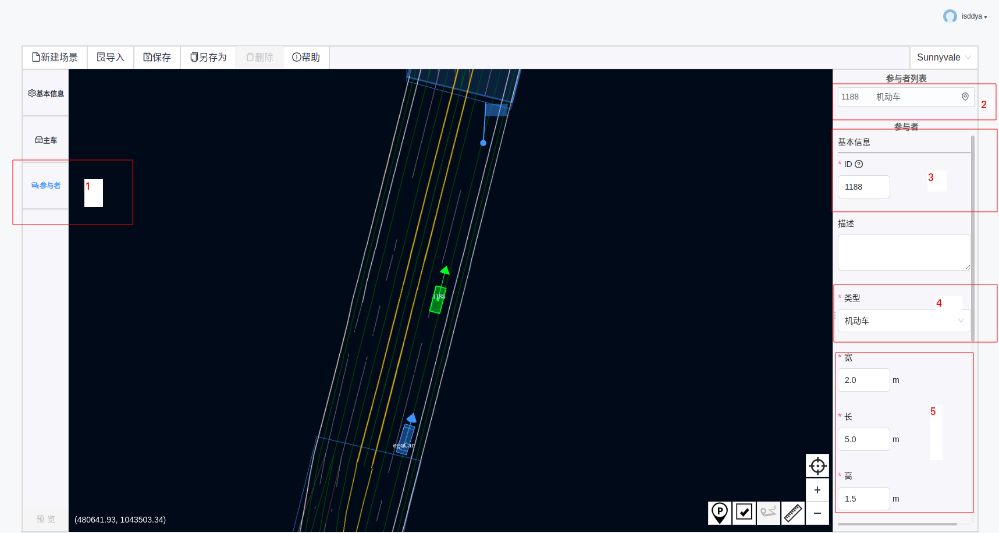
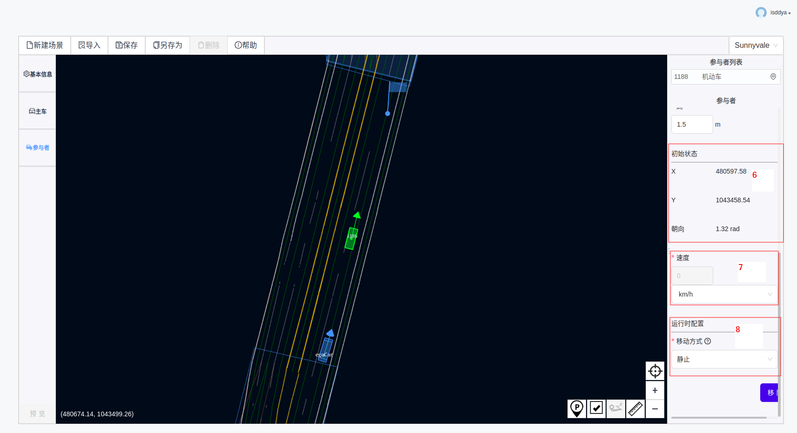

# 前言

## 什么是仿真场景集？

## 为什么要做仿真场景集？

## 如何制作仿真场景集？

# 制作仿真场景集

## 1.注册登录

打开[Apollo社区](https://apollo.baidu.com/),注册个人信息，打开右上角`工作台`，进入[ApolloStudio官网](https://apollo.baidu.com/workspace)并申请仿真试用包。

## 2.进入仿真场景编辑器

打开仿真-->场景编辑-->请选择地图，本次选择Sunnyvale地图（操作步骤如图１所示）

<head>
  <meta charset="utf-8">
  <title>图1</title>
</head>

<body>
  <div align="center">
    
    图1 Dreamview主体界面
  </div>
</body>

## 3.填写基本信息

操作步骤如图２所示：
<head>
  <meta charset="utf-8">
  <title>图２</title>
</head>

<body>
  <div align="center">
    
    图２ Dreamview主体界面
  </div>
</body>

- 基本信息

```markdown
名称：自拟名称
```
```markdown
编号：设定一个场景ID，用来追踪此场景
```
```markdown
描述：描述该场景(可不填)
```
```markdown
描述要点：场景关键词(可不填)
```

- 标签

```markdown
道路结构：可选取直行道、弯道、路口、十字路口、多岔路口、丁字路口、分岔路口中一种或多种
```
```markdown
主车行为：可选取直路直行、直路变道、路口直行、路口左转、路口右转、路口调头、开放空间中的一种或多种
```
```markdown
参与者：设置参与者会自动生成
```
- 自定义

```markdown
此处可自由填写(可不填)
```

- 运行时配置

```markdown
运行时间：默认20秒
```
```markdown
评判标准：(默认即可)
  碰撞检测、限速检测、在路检测、闯红灯检测、到达终点检测、急刹检测、加速检测、导航检测、路口变道检测、礼让行人检测、不必要刹车检测、停车标志前停车检测、中途检查点
  障碍物速度方向突变检测、障碍物速度大小突变检测、障碍物速度检测、障碍物polygon突变检测、障碍物polygon凸点检测
  过分割检测、欠分割检测、虚拟障碍物闪现检测、类别跳变检测、TrackingId跳边检测、近距障碍物闪现检测
  障碍物首次检测距离检测、障碍物朝向变化率、障碍物速度朝向变化率、障碍物朝向与速度朝向一致性、障碍物瞬闪、障碍物跳变、障碍物数目分布检测、障碍物第一次检出距主车距离分布检测
  朝向变化率、速度朝向变化率、朝向与速度一致性、速度大小变化率(收敛)、速度大小变化率(未收敛)、速度大小变化率(所有)、位置变化率、速度与位置自洽误差1s、速度与位置自洽误差3s
```
<!--仿真测试评价标准还不是很明白，需要进一步的学习-->


## 4.选择主车

操作步骤如图3所示

<head>
  <meta charset="utf-8">
  <title>图２</title>
</head>

<body>
  <div align="center">
    
    图3 选择主车操作流程
  </div>
</body>

- 初始状态

`在可视化界面道路上选取起点，鼠标左键拖动选择方向，确定之后，会显示当前位置的经纬度信息及朝向信息`

- 速度&加速度

```
设定初始速度，初始加速度
单位选择m/s，m/s^2时，速度选择区间[0,55]，加速度选择区间[-4.5,4]
单位选择km/h，km/h^2时，初速度选择区间[0,200],加速度选择区间[-58320,51840]
当超出上述范围，可显示“请输入位于区间[0,55]/[0,200]的数字”
```

- 目的地

`可视化界面右下角标注3的位置处点击新增轨迹点，在界面道路中选取轨迹点，若只选取一个点，那么默认为终点。`

- 停车点

`可视化界面右下角有p标识的图标，点击新增停车点，在界面道路中选取停车点`

- 检查点

```
当选取了到达终点检测时，可以添加终点检查点
当选择了中途检查点检测时，至少添加一个中途检查点
```

## 5.选择参与者

操作步骤如图4，图5所示

<head>
  <meta charset="utf-8">
  <title>图4</title>
</head>

<body>
  <div align="center">
    
    图4 选择参与者操作流程1
  </div>
</body>

<head>
  <meta charset="utf-8">
  <title>图4</title>
</head>

<body>
  <div align="center">
    
    图5 选择参与者操作流程2
  </div>
</body>

- 参与者基本信息

```
ID:系统自动生成的无重复编号
```

```
描述:写对参与者的解释(可省略不写)
```

```
类型：可选择机动车，自行车，行人，未知静止障碍物，未知移动障碍物，每个ID只能选取一种类型
```

```
宽：设定区间[0，7]米
长：设定区间[0,30]米
高：设定区间[0,10]米
```

- 初始状态

`在界面选取好参与者位置及朝向时，此处自动生成对应的经纬度信息与朝向`

```
速度：设定参与者速度
```

- 运行时配置

```
移动方式：静止或按轨迹移动
若选取按轨迹移动，则需要选择触发方式(距离或时间)
```

## 6.保存