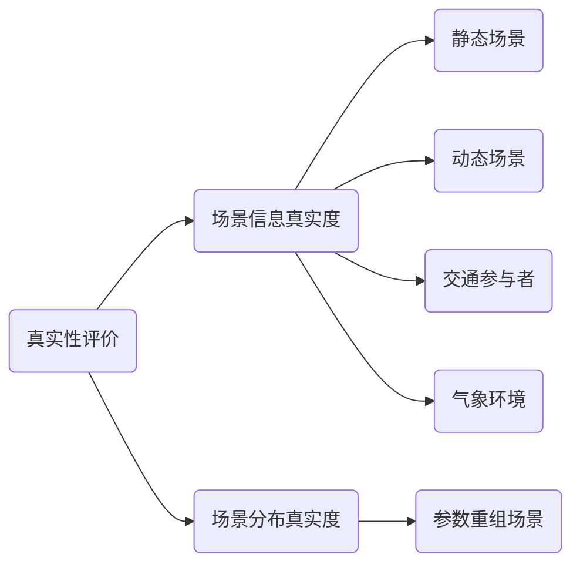

# 引言

自动驾驶汽车需要通过一系列方法评价其“驾驶能力”，例如：驾驶安全性、舒适性、协调性等。由于时间和成本的限制，自动驾驶车辆无法进行充分的道路测试，因此基于虚拟仿真的测试评价，充分验证自动驾驶汽车在`自然驾驶场景`，`标准法规测试场景`，`危险工况场景`，`参数重组场景`下的表现。
利用仿真环境的`真实性`，`可复现性`，`交互性`，`交互性`，`无限性`，`自动化`等特点，自动驾驶系统得到客观测试评价。

## 1. 自动驾驶测试评价方法

自动驾驶测试主要在虚拟仿真软件进行，因此仿真测试评价包括：`仿真测试自身评价`，`自动驾驶车辆驾驶性能`，`驾驶协调性`，`标准匹配性`，`学习进化性`等方面。

## 2. 仿真测试的真实性和有效性评价

自动驾驶测试评价体系中，仿真测试评价是最基础的，只有满足一定条件的仿真测试才能实现促进自动驾驶汽车落地。
仿真测试最核心的是真实性和有效性。

### 2.1 真实性评价

场景信息真实度是指场景建立过程中，要准确地在虚拟环境渲染各种场景信息要素。
场景分布真实度针对参数重组场景由特征元素组合和人工编辑合成场景。由于人工调参后的场景在真实世界不存在，因此，人工编辑场景需要考虑真实世界场景的参数值范围，通过概率分布来确定，适当考虑极端情况，合理化设置参数重组场景。

### 2.2 有效性评价

仿真测试有效性评价在于验证结果准确性。仿真测试局限在于其精确度有限，因此验证仿真测试是为了验证仿真工具链准确性。

## 3. 仿真测试与道路测试的闭环验证

自动驾驶汽车商用之前需要经过`仿真测试` `封闭场地测试` `道路测试` 三个阶段
（1）仿真测试阶段：验证自动驾驶性能及安全
- 针对自动驾驶汽车开发验证、测试评价、检测认证等各个流程审查评估
- 自动驾驶安全性管理体系评估
- 仿真结果到道路测试的应用

（2）封闭场地测试：进行功能及性能评估
- 开展功能及性能评估测试（危险工况场景、自然状态下出现概率低及难以复现的场景）
- 试验精度可控，最大程度保证自动驾驶系统的真实性能，用于验证仿真测试和道路测试的准确性。

（3）道路测试：综合评估及考核认证自动驾驶车辆
- 公开道路车辆行为综合评价
- 评估自动驾驶系统应对真实交通状况的能力
- 自动驾驶系统上路前的考核认证
- 随机覆盖日常驾驶典型场景，防范系统漏洞
- 仿真测试、封闭场地测试、道路测试三者之间互相补充，形成测试闭环，共同促进自动驾驶车辆研发和标准体系建立。

道路测试为仿真测试提供场景基础素材，并且危险场景由仿真测试完成。复杂天气、复杂交通、事故场景等危险场景复现性低，危险性大，难以在道路测试中进行，在仿真测试可以无限次测试，保证了测试安全。
仿真测试补充道路测试，加快自动驾驶测试效率。通过仿真测试不断训练学习，强化自动驾驶算法，提升车辆应对各种场景的能力。