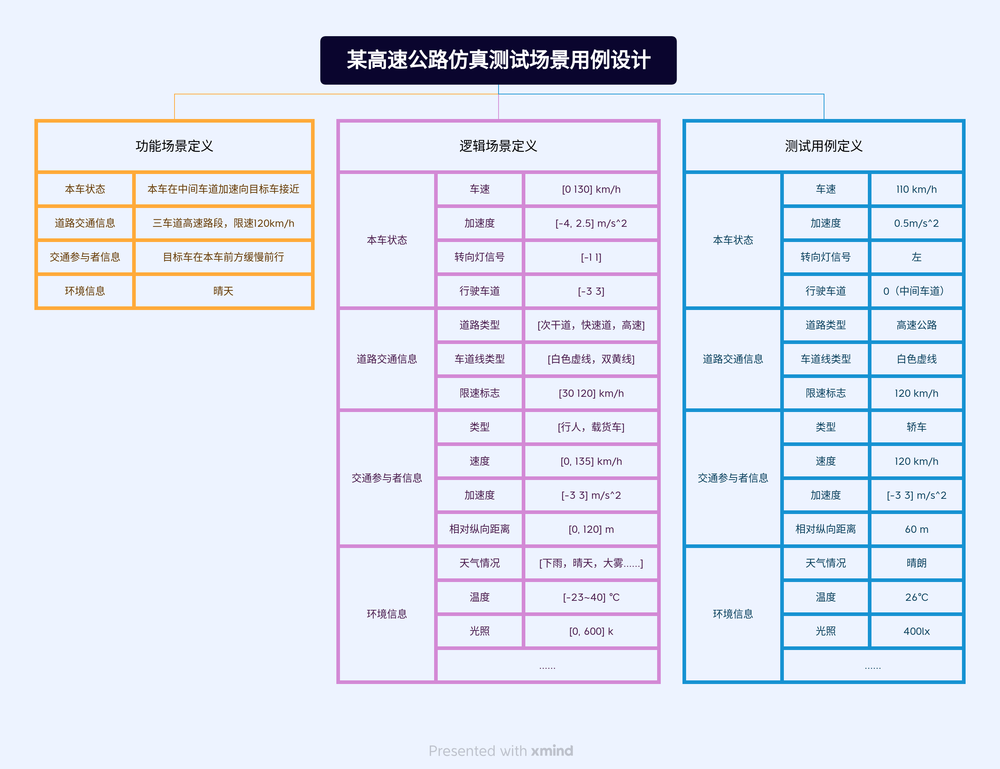
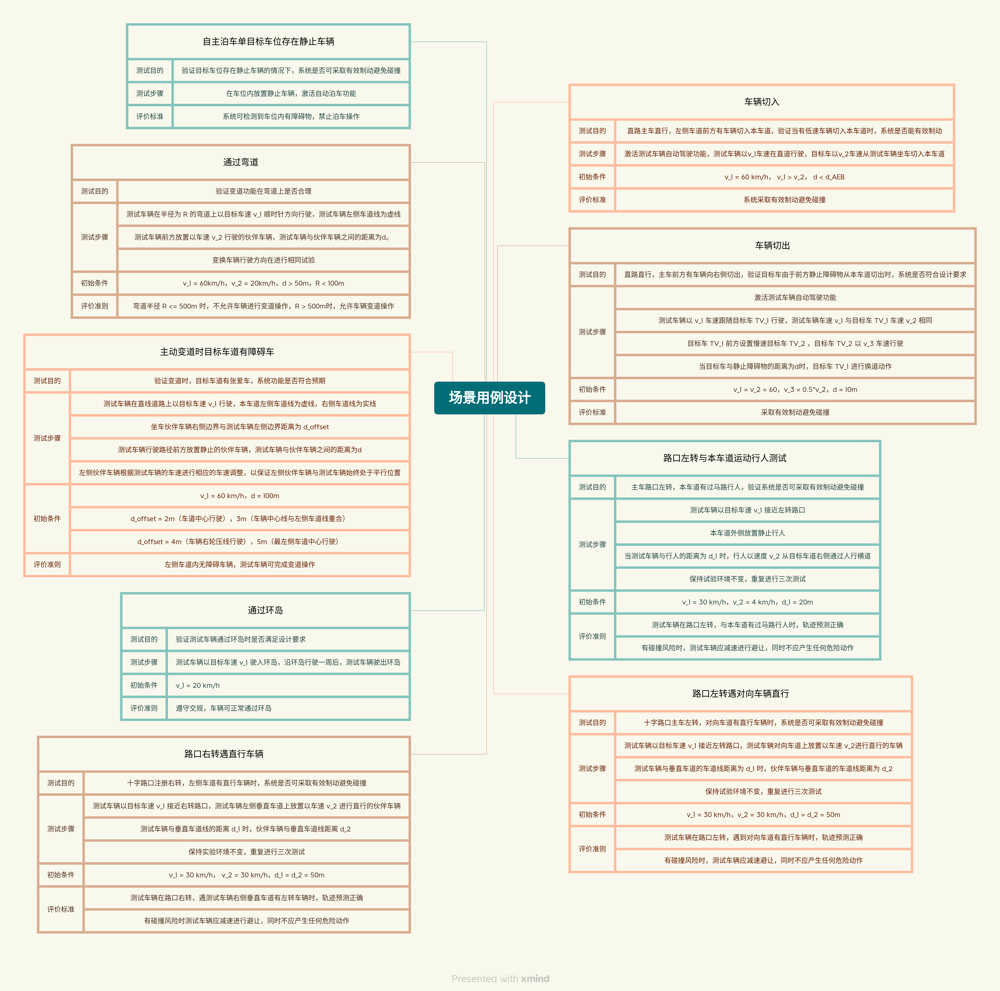

[toc]
# 前言

## 前期知识点

- [自动驾驶测试技术](/autopilot_test/autopilot_test_intro.md)

# 1. 概述

自动驾驶仿真测试是指通过`传感器建模`、`车辆动力学仿真建模`、`高级图形处理`、`交通流仿真`、`数字仿真`、`道路建模`等技术模拟车辆行驶环境，在虚拟环境中加测自动驾驶系统功能和性能有效性和可靠性

## 1.1 仿真测试特点

测试场景丰富

测试高效

模型保真度

## 1.2 基于软件在环仿真测试

## 1.3 基于硬件在环仿真测试

# 2. 仿真测试场景用例设计和案例

测试用例分为三类：`标准测试用例` `标准扩充测试用例` `设计测试用例`

**举例说明：** 某高速公路场景开发

# 4. 具体场景用例设计

# 参考

[1] 2020自动驾驶仿真蓝皮书
[2] 自动驾驶系统功能测试 第7部分：仿真测试（征求意见稿）
[3] 自动驾驶测试场景技术发展与应用

