[toc]

# 前言

## 自动驾驶介绍

# 1 自动驾驶测试概述

在汽车行业，所有技术从开发阶段走向量产，都需要经过复杂的验证环节。一般验证包括三个方面：`企业标准验证` `行业标准验证` `国家标准或法律法规验证`。
自动驾驶汽车测试方法主要分为`基于场景的测试方法`和`基于里程的测试方法`。

- 基于场景的测试方法：通过预先设定的场景，要求被测车辆在一定的环境条件下连续行驶，而不预先设定其测试任务或目标。
- 基于里程的测试方法：被测车辆在一定环境条件下连续行驶而不预先设定其测试任务或目标。


# 2. 自动驾驶测试场景技术

## 2.2 测试场景

### 2.2.1 测试场景概述

**场景**在自动驾驶领域被认为是一定时间和空间范围内行驶环境与汽车驾驶行为的综合反应；描述了外部道路、气象和交通参与物以及车辆自身的驾驶任务和状态等信息。
**测试场景**是具有特定测试目的的场景。

### 2.2.2 场景要素

场景要素一般指：`测试车辆` `静态环境` `动态环境` `交通参与者` `气象`

```
1. 测试车辆要素
```
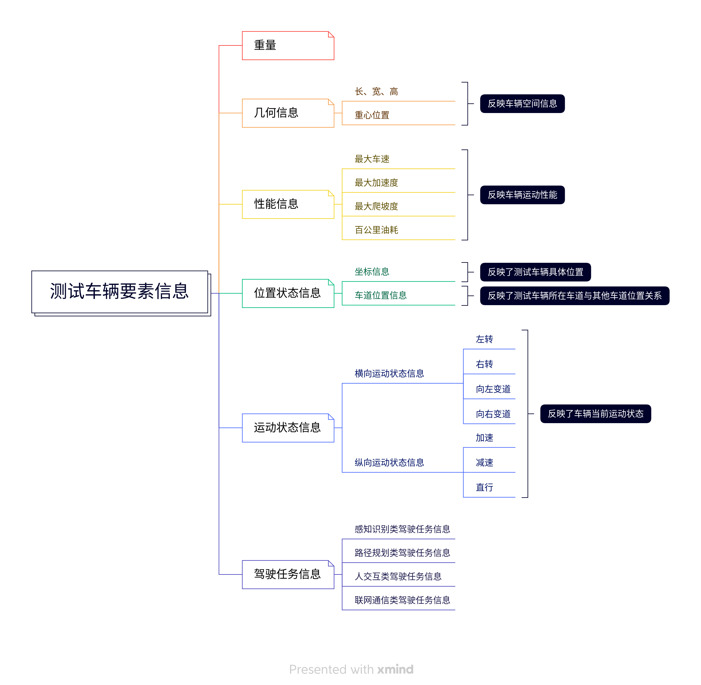

```
2. 静态环境要素
```
无运动物体，且通过视觉可以感受到的区域场景。

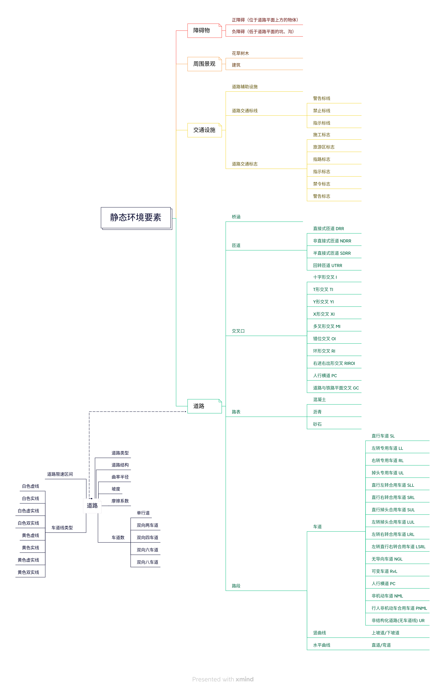

```
3. 动态环境要素
```

车辆动态驾驶任务中处于动态变化的要素。

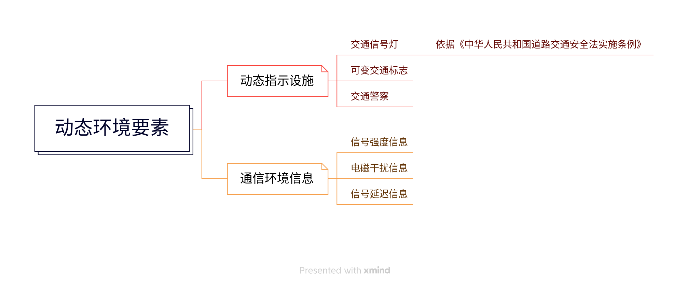

```
4. 交通参与者要素
```

交通参与者信息描述的事在自动驾驶测试场景中对本车决策规划造成影响的对象信息。

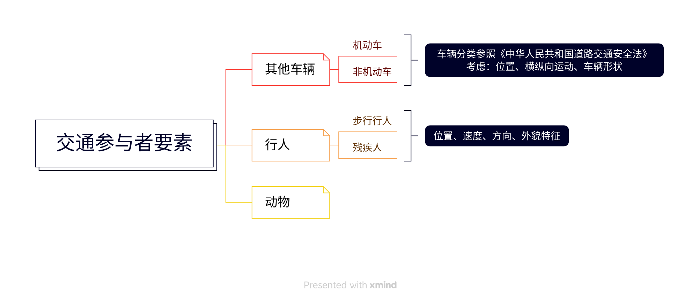

```
5. 气象要素
```

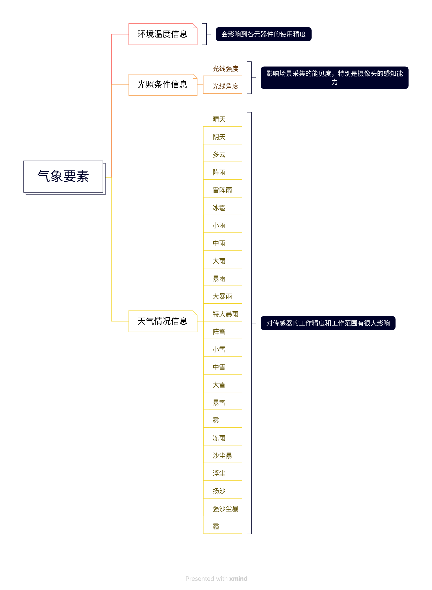

**场景要素的属性及联系**：
属性信息：要素行状、大小等几何信息；速度、加速度等运动信息
对象之间联系：逻辑关系、附属关系

### 1.2.3 测试场景分类

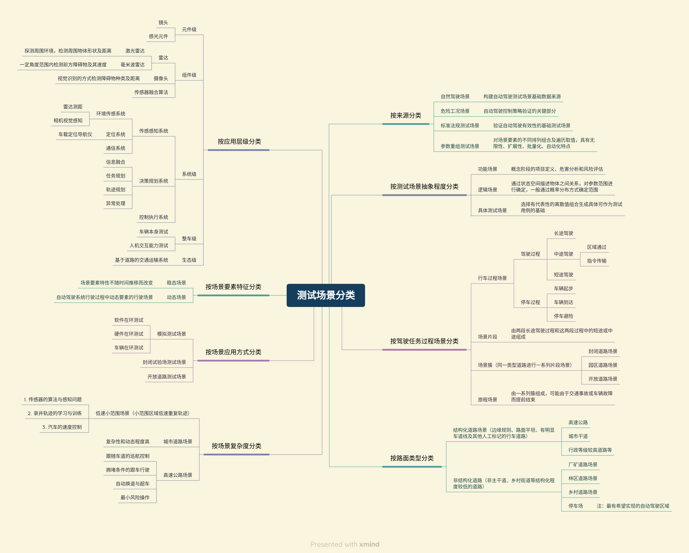

## 2.3 场景构建流程

自动驾驶测试场景构建是以当今汽车、驾驶、通信技术为基础，以交通、法规和人文环境为背景，从自动驾驶功能本体视角出发，广泛采集真实交通场景数据，分析自动驾驶影响因素，结合已有驾驶经验进行分析挖掘、概括提炼，形成用于判断自动驾驶安全性、高效性，具有真实性、代表性和有效性的流动的要素和参数的集合。

### 2.3.1 场景构建流程

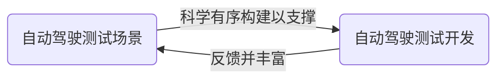

自动驾驶测试场景结构：`场景层` `数据层` `测试执行层`

- 场景层：测试体系的基础，需要对测试体系聚合，同时将测试内容拆分细化
- 数据层：负责从各方面采集场景构建所需要的数据，并将其处理导入场景层。
- 测试执行层：通过调用场景库中的场景为测试服务，并将测试结果反馈给场景库

```
场景库：场景的载体平台，通过场景数据采集、分析、挖掘、测试验证等将各层数据有机连接实现内容闭环
```

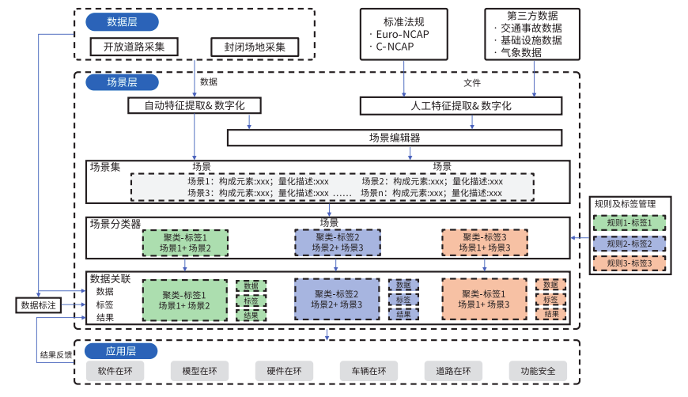

**实现步骤：**

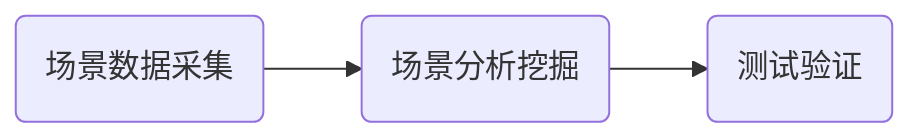

### 2.3.2 场景数据采集技术

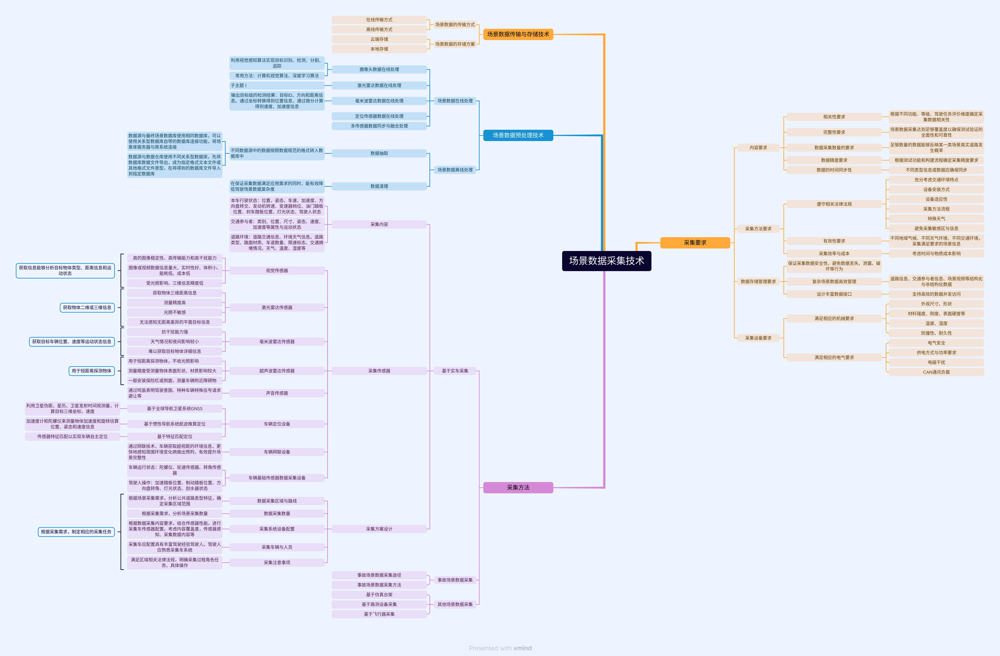

### 2.3.3 场景分析挖掘技术

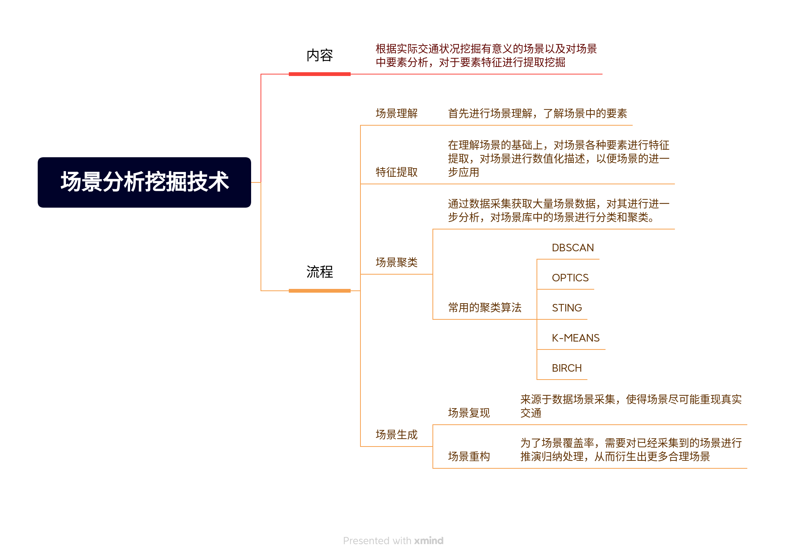

### 2.3.4 场景验证技术

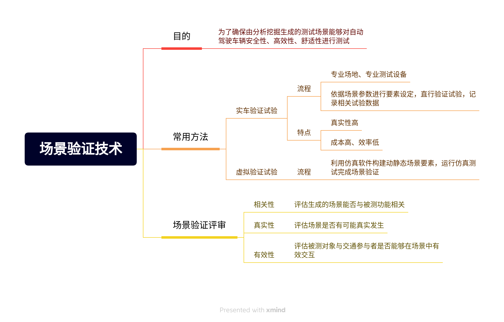

## 2.4 场景库技术

场景库是不同场景的几何，每个具体的场景由数据组成。建立场景库系统是为了对自动驾驶测试场景进行有效的组织、管理与应用。

### 2.4.1 场景库技术概述

场景库技术内容包括对场景数据进行统一的组织和管理以及搞笑的获取与处理数据，包括增加、修改、删除、分析、理解等操作所需的合理架构及完整数据库解决方案。

### 2.4.2 场景库系统架构

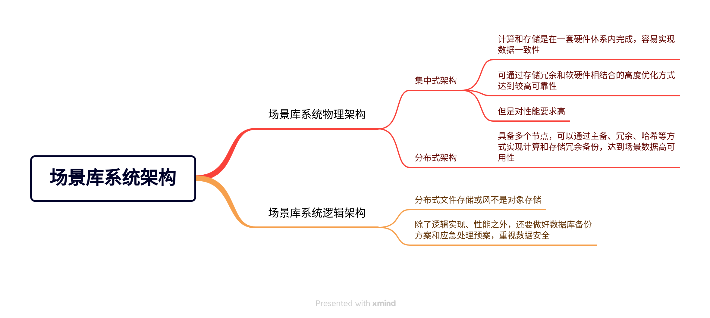

### 2.4.3 场景库数据格式

在数字化场景中，对于场景的描述主要分为两大部分：`对于主车的行为描述` `对于周围环境的行为描述`

主车行为描述：主车自身的习惯是规划路线

周围环境描述：`交通灯`、`静止障碍物`、`运动障碍物`、`不同种类障碍物`

（1）**特征标签申明格式**

对于场景的主要特征进行概要描述，特征分为三级

**举例说明：** 车辆通过有信号灯十字路口与障碍物

```
一级特征标签：“主车行为+交通信号灯+道路+障碍物”
二级特征标签：“直行+球形交通信号灯+十字路口+移动障碍物”
三级特征标签：“机动车类型障碍物”
```

（2）**定位信息描述**

定位信息包括：`地图信息` `车辆起始位置`

- 地图信息：用例所使用的的地图编号、道路拓扑结构
- 起始位置：车辆在参考地图位置

（3）**主车行为模型构建**

主车行为模型：描述车辆的行驶任务。行驶路线设置起点、终点作为路线规划点。可以为车辆设定等待、停止等任务

（4）**红绿灯模型构建**

红绿灯模型用于声明交通灯对象。红绿灯对象需要设定`初始颜色` `信号控制器`

（5）**障碍物模型构建**

障碍物模型用于声明障碍物对象，可以声明多个对象。障碍物类型使用某类控制器以及障碍物参数：`初始化位置` `类型` `外形` `尺寸`等

### 2.4.4 场景库接口定义

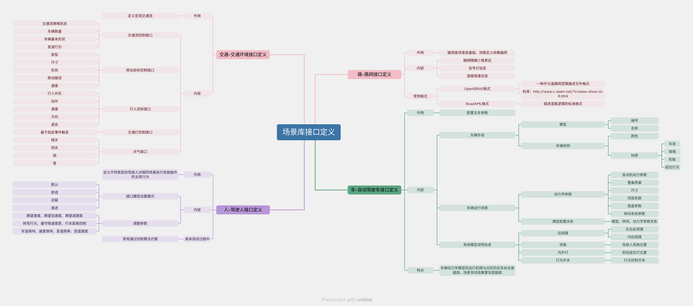

### 2.4.5 场景库管理

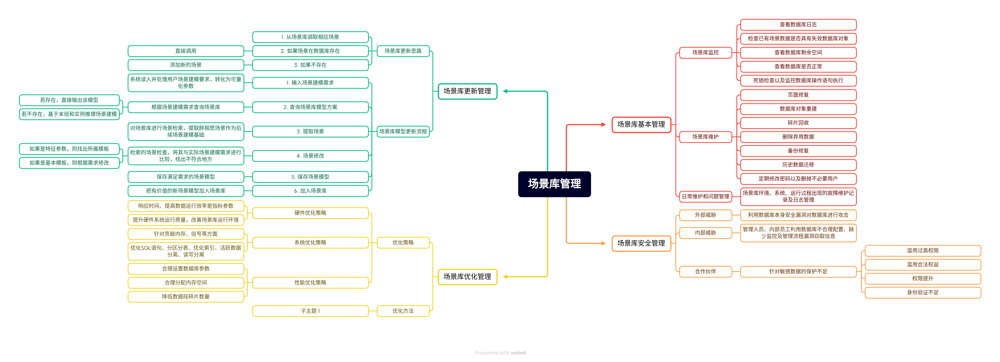

## 2.5 测试场景标准体系构建

标准是科学、技术和实践经验的总结。为在一定范围内获得最佳秩序，对实际或潜在的问题指定共同的和重复使用的规则的活动，即指定、发布及实施标准的过程。

## 3. 商用车驾驶验证场景

### 3.1 高速自动驾驶场景应用

### 3.2 港口园区自动驾驶场景应用

### 3.3 矿区园区自动驾驶场景应用


# 参考

[1] 自动驾驶测试场景技术发展与应用
[2] 智能网联汽车测试与评价技术