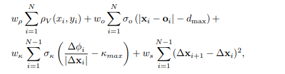
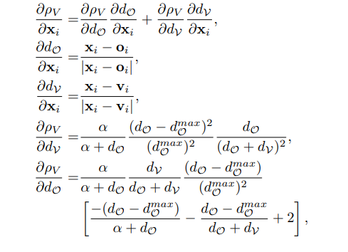
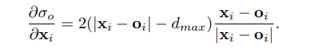
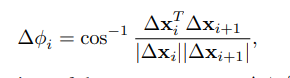
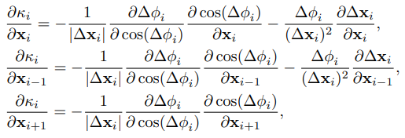
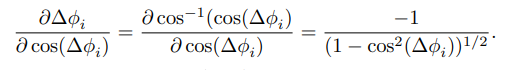
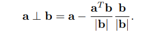
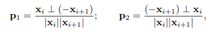

# 前言

本文是针对《Practical Search Techniques in Path Planning for Autonomous Driving》论文学习的笔记，所选论文是2007年DARPA城市挑战赛中，同时Hybrid A* 算法也是在这篇文章中首次提出，因此对于学习自动驾驶规划算法（特别是 Open Space场景下的规划算法）有着重要的意义。

论文地址：[Practical Search Techniques in Path Planning for Autonomous Driving](https://www.aaai.org/Papers/Workshops/2008/WS-08-10/WS08-10-006.pdf)

------

**注**: 以下是学习论文相关的笔记，尽量遵从原文意思加一些个人理解的内容。

# 摘要 

描述了一种实用的路径规划算法，为在未知环境中运行的自主车辆生成平滑的路径，其中的障碍物由机器人的传感器在线检测。这项工作是由2007年DARPA城市挑战赛激发的，并在该比赛中得到了实验验证，在该比赛中，机器人车辆必须自主导航停车场。采用的方法有两个主要步骤。第一步使用著名的A* 搜索算法的变体，应用于车辆的三维运动状态空间，但有一个修改过的状态更新规则，在A* 的离散节点中捕捉到车辆的连续状态（从而保证路径的运动可行性）。第二步是通过数字非线性优化来提高解决方案的质量，从而达到局部（经常是全局）最优。本文描述的路径规划算法被斯坦福大学赛车队的机器人 $Junior$ 在城市挑战赛中使用。$Junior$ 在复杂的一般路径规划任务中表现出完美的性能，如导航停车场和在堵塞的道路上执行掉头，典型的全周期复制时间为50-300ms。

# 介绍和相关工作

图1 Junior车

## 创新性工作

该论文主要创新性内容：

1. 第一步使用连续坐标中的启发式搜索，保证计算轨迹的运动学上的可行性；
2. 第二步使用共轭梯度（CG）下降法来局部提高解决方案的质量，产生一个至少是局部最优的路径，但通常也能达到全局最优。

# 混合状态的A* 搜索

## hybrid A* 算法简介

本算法是 A* 算法的变体，适用于车辆在三维运动状态空间并可以在离散搜索节点中获取连续状态的数据，其主要是将车辆的连续三维状态与每个单元格联系起来。如下图所示，左图是传统A* 的搜索过程，仅访问与网格单元格中心对应的状态；中间是 Field D* 算法的搜索过程，将成本与单元格的角关联，并允许从单元格到单元格的任意线性路径；右图是 hybrid A* 算法搜索过程，将一个连续状态与每个单元联系起来，单元的代价值是其相关连续状态的成本。

图2 三种规划算法网格搜索过程

由于合并了离散化空间在同一单元的连续坐标状态，使得hybrid A* 算法并不能保证找到最小成本的路径，但可保证所搜索的道路是可驾驶的，即满足车辆或带约束机器人的运动学约束。在实践中，hybrid A* 所搜索的路径通常会在全局最优解的附近，这样就可以通过路径优化(梯度下降法改善)到达全局最优解。

## hybrid A* 算法特点

hybrid A* 算法的主要优势是：

1. 在狭小空间的机动中，在那里离散化误差变得非常关键；
2. 算法规划了正向和倒向行驶，并对倒向行驶以及切换运动方向进行了相应的惩罚；

## hybrid A* 算法原理

### 启发式搜索算法：

hybrid A* 算法是由两个启发式算法组合而成的，启发式搜索方法不依赖于hybrid A*算法，可应用与其他搜索方法。

- 第一种启发式搜索算法是“non-holonomic-without-obstacles（无障碍的非整体性搜索）”。顾名思义，这种启发式是考虑汽车的非整体性（即汽车具有运动学、动力学约束）而忽略了空间中障碍物信息计算到目标点的最短距离。假设目标状态为$（x_g, y_g, \theta_g） = (0,0,0)$, 并假设完全没有障碍物，从目标某个离散邻域的每一点$（x,y,\theta）$。计算到目标的最短路径。然后通过成本的最大值和欧氏距离作为启发式。这样修剪了那些以错误的路径接近目标的分支。这种启发式方法提供了近一个数量级级别的改进，与直接欧式距离成本相比，扩大了节点的数量。

- 第二种启发式搜索算法是“holonomic-with-obstacles(有障碍的整体性搜索)”，忽略了汽车的非整体性，在考虑障碍物的空间地图中计算到目标的最短距离。这种方法的有点是在2维中发现U形障碍或死胡同，然后引导三维搜索远离这些区域。

选择两种启发式方法的最大值作为最终的启发函数值。

### 分析性扩展

在启发式搜索中使用的是离散的空间，那么搜索将无法达到精确地连续目标状态（精度取决于A* 中网格的分辨率）。为了解决精度问题，并提高搜索速度，基于`Reed-Shepp`模型的分析性来增强搜索，通过树的节点来模拟汽车运动学模型在一段时间内的一个特定动作。除此之外，通过计算当前状态到目标的最优`Reed-and-Shepp`路径，也会生成一个子树。之后，通过路径检查是否与障碍物地图发生碰撞。

**缺陷：** 使用`Reed-Shepp`应用到每个节点，特别是离目标远的地方，路径可能会穿过障碍物。

**解决方案：** $Reed-Shepp$ 扩展应用于每`N`（N随着成本-启发式函数的而递减）个节点中的一个，这样当更接近目标时，需要更加频繁的分析性扩展，而距离较远时，相对使用更少。

图3 路径搜索过程

​														 

上图显示了一个具有`Reed-Shepp`扩展的搜索树。由节点的短增量扩展产生的搜索树显示在黄绿色的范围内，$Reed-Shepp$ 扩展显示为通往目标的纯紫色线条。搜索树的这一分析性扩展综合考虑了准确性和实时性。

# 使用 Voronoi 场的路径成本函数

 使用 $Voronoi$ 场来定义路径长度和接近障碍物之间的权衡。

$Voronoi$场：

其中 $d\vartheta$ 和 $d\upsilon$分别是到最近的障碍物和广义 $Voronoi$ 图(GVD) 边缘的距离 $\alpha > 0$和 $d_{\vartheta} > 0$分别控制这场的衰减率和最大有效范围。式(1)中$d_{\vartheta} <= d_{\vartheta}^{max}$,否则 $\rho_{V}(x,y) = 0$

具有以下特性：

1. 当  $d_{\vartheta} >= d_{\vartheta}^{max}$ , 它为0；
2. 在$\rho_{V}(x,y) \in [0, 1]$上是连续的，因为不可能同时存在$d_{\vartheta} = d_{\upsilon} = 0$
3. 只在障碍物内达到最大值
4. 只在GVD边缘达到最小

优点：场值与可用于导航的总间隙成比例，这样即使狭窄的开口也可以通航。

图4 狭窄路段对应势场图

上图中第一幅显示了 $Voronoi$ 场的二维投影，第二幅给出了响应的广义 $Voronoi$ 图，这里相互靠近的障碍物之间的通道不会有势场阻断，中间总会有一条连续的势场为0的路径；第三幅中在狭窄的通道上有高电位区域。

<!--这里代价值计算公式可以调整，已达到更优化效果，例如：衰减率的问题等-->

# 局部优化与平滑

hybrid A* 算法产生的路径往往是次优的，需要进一步改进(这里指的是生成的路径对于车辆可以行驶，但是可能包含不自然的转弯或不必要的转向)。因此需要针对其进行后处理，本次后处理分为以下两个阶段。

第一阶段：对路径顶点的坐标制定一个非线性优化以提高解决方案的长度与平滑度

第二阶段：使用另一个共轭梯度的迭代和更高分辨率的路径分解进行非参数插值

- 给出一个顶点序列, $X_i = (x_i,y_i),i \in [1,N]$, 变量 $o_i$ 是障碍物离顶点最近的位置；

- 在顶点位置的位移： $\Delta X_i = X_i - X_{i - 1}$；

- 顶点的切向角的变化： $\Delta \phi_i = |tan^{-1} \frac {\Delta y_{i + 1}}  {\Delta x_{i =1}} - tan^{-1} \frac {\Delta y_i} {\Delta x_i}|$

**平滑代价函数：**

式中：$\rho_V$是 $Voronoi$ 场；$\kappa_{max}$是路径的最大允许曲率（车辆最小转弯半径）；$\sigma_o$和$\sigma_{\kappa}$是惩罚函数（二次惩罚函数）；$\omega_{\rho},\omega_{o}, \omega_{\kappa}, \omega_{s}$是权重

- 第一项可以有效地引导机器人在==狭窄的通道远离障碍物==
- 第二项对==与障碍物的碰撞进行惩罚==
- 第三项是==对每个节点上的轨迹的瞬时曲率的上限限制，并强制执行车辆运动学约束==
- 第四项是==一个衡量路径的平滑度==

计算上述成本函数的梯度以直截了当的方式进行，如下所属，对于 $Voronoi$ 场，当$d_{\vartheta} <= d_{\vartheta}^{max}$

其中 $v_i$ 是最接近顶点$i$的`GVD`边缘的点坐标的`2D`向量，我们通过维护`kd`树来计算最近的障碍物$o_i$和最近的`GVD`边缘点 $v_i$所有障碍点和`GVD`边点，并在共轭梯度的每次迭代中更新顶点的最近邻点。

对于具有二次方的碰撞惩罚，如果 $x_i - o_i <= d_{max}$

对于顶点 $i$ 的最大曲率项，对影响 $i$ 点曲率的三个点进行导数：$i - 1, i, i + 1$ 。在这种计算中，节点 $i$ 的切向角的变化表示为：

曲率的导数：$k_i = \frac {\Delta \phi_i} {|\Delta x_i|}$

对应的三个节点坐标分别为：

**通过正交法表示：**

**归一化：**

**化简为：**
$$
\frac {\partial cos(\Delta \phi_i)} {\partial x_i}= -\boldsymbol{p_1} - \boldsymbol{p_2};
$$

$$
\frac {\partial cos(\Delta \phi_i)} {\partial x_{i - 1}}= \boldsymbol{p_2};
$$

$$
\frac {\partial cos(\Delta \phi_i)} {\partial x_{i + 1}}= \boldsymbol{p_1}
$$

使用上述的CG平滑法，得到的路径比A*方案要平滑得多，但它仍然是片状线性的，顶点之间有很大的距离（在我们的实现中大约是0.5米-1米）。这可能 导致物理车辆的转向非常突兀。因此，我们使用插值法在CG解决方案的顶点之间进一步平滑路径。顶点之间的插值来进一步平滑路径。许多参数插值技术对输入中的噪声非常敏感，并且会加剧输出中的任何这种噪声（例如，三维样条会导致输出中出现任意大的振荡，因为输入顶点越来越靠近 顶点之间的距离越来越近，会导致输出中出现任意大的振荡）。

采用非参数插值，即通过增加新的顶点来对路径进行超采样，并使用CG技术。通过增加心的顶点对路径进行超采样，并使用CG来最小化路径的曲率，同时保持原来的顶点固定。

# 结果

图9描述了Junior在比赛中驾驶的几条轨迹，其中(a-c)显示了堵塞的道路上调头的情况。图10表示了在类似迷宫环境的解决方案。**由两图可以看出，所规划的轨迹具有非常平滑的性能。**